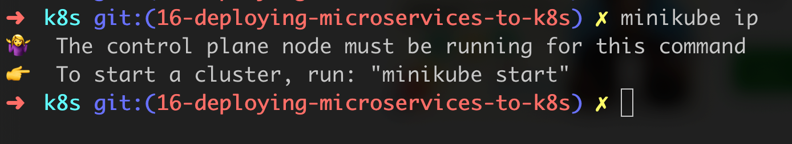

Before begin - we have to watch XIII - Kubernetes AKA k8s videos 
- running KubeCluster Locally - video 5 - minikube ...
- in this course we will use minikube
- Installation : Docker + Minikube  
Video 6 - Minikube installation
  
  
  
[link](https://minikube.sigs.k8s.io/docs/start/)
- Preferences before change it to 6 gb

- if we say minikube start --help
  
  
  
- we say minikube start --memory=4g
  
  
  
  
Video 7 - Installing kubctl

We need to make binary kubctl executable

And we need to move the kubctl binary to a file location in our system path

  Video 8 - Kubernetes video Hello World
 

- Let's open the browser

now if we want to delete 

  Video 9 - Pods (Smallest unit) 
  Video 11 - Services - never use port-forward(Only testing)
          -instead use service . It has a stable ip address
  Video 12 - Service Discovery

# 1 - Intellij k8s Plugin

# 2 - Deploying Postgres, Rabbit and Zipkin
- never deploy postgres on production inside a 
kubernetes cluster
# 3 - Postgres YAMLS

# 4 Postgres Running in k8s
inside minikube folder

Let's investigate logs

We will create our databases (customer, fraud and notification) 

Conclusion : we have created databases that our microservices will need, but never do it in production , 
only for testing;

# 5 Exercice
# 6 Exercice solution
Technically it's not the correct way to deploy them (rabbitmq an zipkin) to kubernetes
if we are running in production;

Logs
kubectl logs rabbitmq-0
kubectl logs zipkin-0
kubectl get all

Now we will launch some services
- Rabbit MQ

Open browser and past in it http://127.0.0.1:56194  
user - guest and password - guest 
- 
- Zipkin

 Open browser and past in it http://127.0.0.1:56194  

- Have a look - type is Loadbalancer and status is pending 

If we want to access our loadbalancer that we have within minikube, 
just type minikube tunnel

- That give me to access my service on the specified ports 9411

