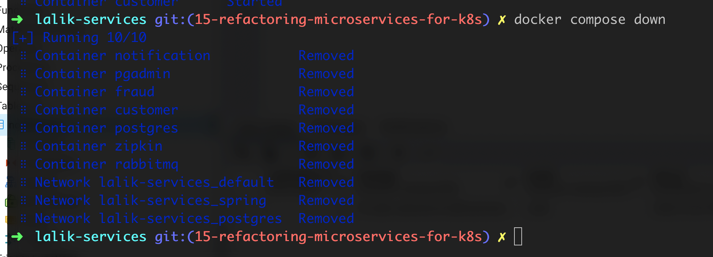

# 1 - Disabling Eureka 
Kubernetes offers service discovery for free , we have one less service to manage.
Disabling Eureka in customer , fraud and notification services

# 2 - Refactor Feign Clients

for customer , fraud and notification 

# 3 - Adding SPRING_PROFILES_ACTIVE=default

We open docker-compose.yml file and first we comment eureka ans api gateway parts

We also temporally comment in docker-compose.yml file customer , fraud and notification

We want just to start with docker-compose rabbitmq , zipkin pgadmin and postgres.
Within the root let's just say 

Now let's run from Idea customer , fraud and notification.
It gives us an error , Nelson thinks that it's a bug and we have to sau in IntelliJ ,
that we want default profile. 

For fraud and notification we do the same thing
Now all three services are running from idea

And pgAdmin with zipkin and RabbitMQ are also running from docker-compose.yml

In local development we send request directly to customer with postman port 8080

# 4 - Kube profile

We also have to have profile with kube suffix or the similar file within customer,fraud and 
notification

# 5 - Building new Images and Testing Docker Compose

The final thing that we have to do is to make sure that we can run our microservices with docker.
Let's actually make sure that we can basically test things with Docker.
For example if we have a new joiners in our team , then they can jus run a set of containers and 
have the entire application stack working without no effort.
Inside of client -> resources , we need to create clients-docker.properties

Let's open up the docker profile and uncomment customer , fraud and notification that we have 
made before temporally and remove the section depends on eureka etc 
Now let's test it out , open up the terminal , let's build a new image with 

So we have new images, now we can pull those images with command  
_docker compose pull_ 
Now we say docker compose up -d

Now let's open up Postman and send directly request to customer which is on 8080

Stop containers
