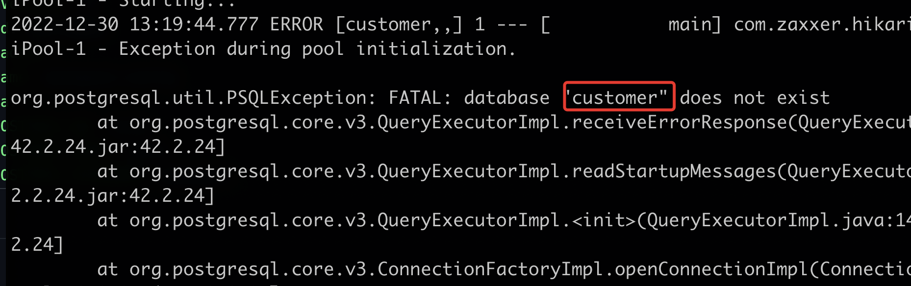

# Customer YAMLs
Within k8s folder and minikube folder . let's have a new folder 'services' and within
let's have 'customer'

Let's create in customer new file deployment.yml

Let's apply the yml that we have added
Inside  the k8s folder

I receive this , I think because  nothing is deployed now in k8s

I have tried to write minikube ip

So I have launch minikube cluster with command _minikube start_

I have tried to apply customer , but I have incorrectly run the command 

If we say _kubectl get pod_

With this command 

we have some errors

When I try to see logs 

I don't know why , but i have tried to delete pod customer 

Then after when I try to see actual pods , I have a new instance o customer running
without errors.

# Fraud and Notification YAMLs

 And the same thing with notification - > type NodePort

Let/s go to minikube folder

I have all three microservices not running , it gives me error .
So I stop the minikube 

And Restart it

After few moments we have CrashLoopBackOff status for all 3 services

I have tried a lot of things , and the conclusion is,that when
postgres was uploaded with incorrect password , the only way is to redeploy with 
correct password 

I have asked on amigoscode page - > but it didn't worked

1st - delete minikube

2nd - 
3rd - Apply bootstraps

Get pods 

4th - Apply service/customer

Because we do not have yet the 3 db customer,notification and fraud , when we logs
into customer , we do not have connection to db 

Enter psql postgres

Reapply service/customer

Now when we log into customer all it's ok 

Apply fraud and notification

Now when all is running without errors
We have to look at he services 
We have fraud,customer,notification : fraud and notification ,these are internal ,
they can be accessed by internal ports, but customer is type LoadBalancer as well 
as Zipkin.

If we want access our LoadBalancer , we can just say _minikube tunnel_

After entering the password because port 80 needs privileges, 
lets open up Postman , and we can send the request to customer on port 80.
Before we were accessing on 8080 , but because we've changed its service to listen 
on port 80, we have to say _localhost/api/v1/customers_

This time the request should go through all microservices
Let's also check Zipkin on http://127.0.0.1:9411/zipkin/

To stop tunnel for customer and zipkin _ctrl C_ 

