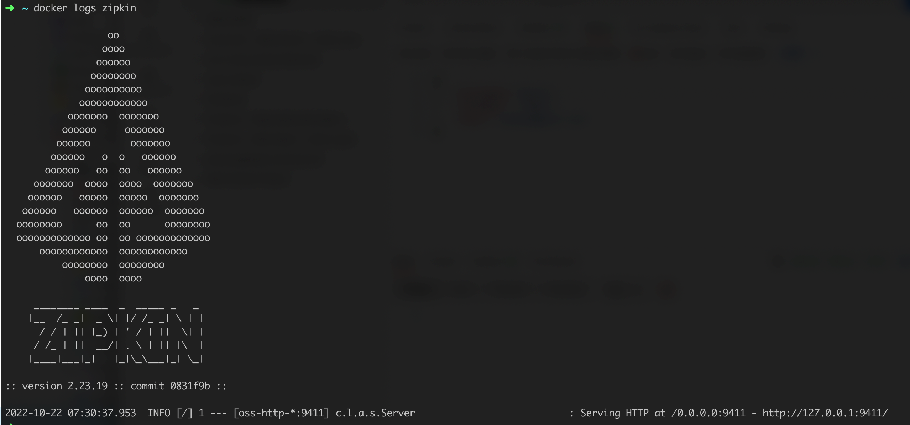

- Add dependency 'spring-cloud-starter-sleuth' to customer, eureka-server, fraud, notification 

- Zipkin container 

- docker-zipkin-logs

- Add 'spring-cloud-sleuth-zipkin' dependency to customer, eureka-server, fraud and notification modules
If spring-cloud-sleuth-zipkin is available then the app will generate and report Zipkin-compatible traces via HTTP.

- Configure the location of the service using spring.zipkin.baseUrl in application.yml file for each microservice

- After run each microservice and sending request in postman 

we have zipkin in action with total of spans and with trace id etc
